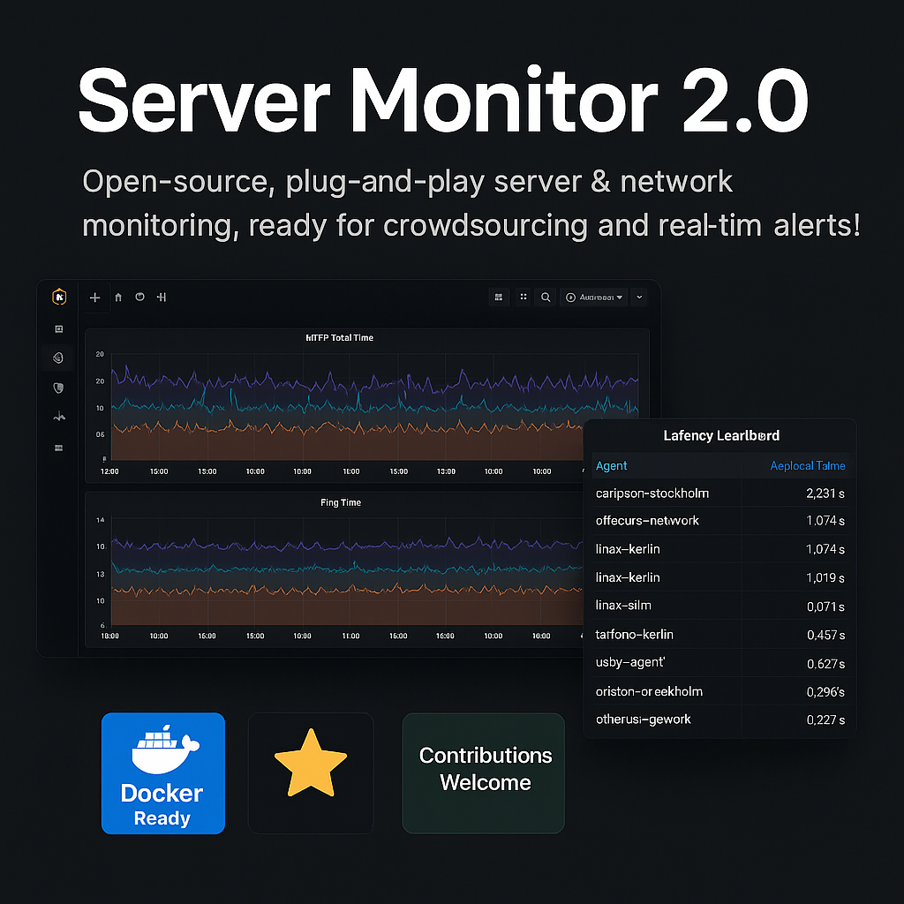

# Server Monitor 2.0



---

## What is Server Monitor 2.0? 🛰️

**Server Monitor 2.0** is an open-source, plug-and-play platform for monitoring and comparing server, network, and API performance across the internet or within your own infrastructure.  
It is designed for **everyone** – from solo developers and small teams to power users and communities – who want simple, transparent, real-time insights into latency, availability, and basic network health.

- **Run your own agent** (Bash or Python) from anywhere.
- **Visualize results instantly** in Grafana, either locally or on your own cloud.
- **Contribute data** (if you want) to a public leaderboard.
- **Set up custom alerts** (Slack, Discord, Email) for issues.
- **Keep your data private – or share it for science!**

---

## Why does this project exist? 🎯

- **Internet monitoring shouldn't be hard**. Most commercial tools are complex, expensive, or limit transparency.
- **You own your data.** You choose if it’s private or public.
- **Crowdsourced stats are powerful.** By sharing anonymized metrics, we all get a better picture of network health and CDN/provider performance – globally or regionally.
- **Easy, fast setup.** From git clone to dashboard in minutes.

---

## Key Features

- **Bash & Python agents** – runs everywhere: Linux, Mac, Windows (WSL), Raspberry Pi, cloud VMs.
- **Super simple config** – just edit one YAML file.
- **Modern Docker stack** – one command, everything runs.
- **Grafana dashboards auto-provisioned**.
- **Public leaderboard support** (if you want).
- **Alerting**: Slack, Discord, email – all standard via Grafana.
- **REST API ready**: fetch/export metrics for your own tools.

---

## 📦 Quick Start (For Beginners & Power Users)

1. **Clone the repo**
    ```bash
    git clone https://github.com/Caripson/server-monitor.git
    cd server-monitor
    ```

2. **Start with Docker Compose**
    ```bash
    docker compose up -d
    ```
    This launches:
    - **InfluxDB 2.x** (metrics database)
    - **Grafana 10+** (visual dashboards)

3. **Access the dashboards**
    - Grafana: [http://localhost:3000](http://localhost:3000) (User: `admin`, Pass: `admin`)
    - InfluxDB: [http://localhost:8086](http://localhost:8086) (User: `admin`, Pass: `supersecret`, Org: `server-monitor`, Token: `mytoken`)

---

## 📝 How It Works

**You run an “agent” (script) on any computer/server.**  
The agent:
- Reads your targets (websites, IPs, DNS) from a config file (`endpoints.yml`)
- Measures latency, ping, DNS or HTTP performance
- Sends all data (with your agent name) to InfluxDB
- Grafana shows everything, and can alert you if something is wrong

---

## 🔧 Setting Up Your Own Agent

Edit the config:

```yaml
agent: my-home-laptop # give your agent a unique name!

endpoints:
  - url: https://www.google.com/
    name: Google
    type: http
  - url: 8.8.8.8
    name: Google DNS
    type: ping
```

**Run in Bash:**
```bash
pip install pyyaml
chmod +x agent.sh
./agent.sh
```
**Or Python:**
```bash
pip install requests pyyaml
python3 agent.py
```

- You can run multiple agents from as many places as you want (home, VPS, datacenter, cloud).
- Data appears automatically in your Grafana dashboard.

---

## 🖥️ The Dashboard

- Auto-generated!  
- Shows all your endpoints, all your agents, over time.
- Includes:  
  - HTTP latency (total, connect, DNS, etc)
  - Ping time
  - **Leaderboard:** Compare your agents (who/where is fastest?)

---

## 🌐 Public Dashboard, Community & “Fake” Links

**The link below is an example**.  
There is *no live service* at [https://community.monitor.example.com/grafana/d/public/leaderboard](https://community.monitor.example.com/grafana/d/public/leaderboard).  
- If you want a **public dashboard**, you must host Grafana yourself (on your own domain).
- Replace all “example.com” links with your real address!
- Never share your InfluxDB admin tokens on a public server.

**To set up your own public dashboard:**
1. Deploy Grafana and InfluxDB on a public server (cloud VPS, Kubernetes, etc.)
2. Set a real domain (use Let’s Encrypt or Cloudflare for HTTPS).
3. Update your README and `endpoints.yml` with your new URLs.
4. Share your link in your community or with your team!

*Want to contribute to a real global leaderboard? Ping us in Issues or Discord!*

---

## 🚨 Alerts & Notifications

- **Set up notifications in Grafana** – full docs [here](https://grafana.com/docs/grafana/latest/alerting/).
- Slack, Discord, Email, Webhook, Teams – all supported.
- Example: Alert if “total HTTP latency” > 2 seconds.

---

## 🧠 Tips, Tricks & Corner Cases

- **Firewall?** Make sure your agent machine can access your InfluxDB and targets.
- **Run as cronjob:** Agents can be scheduled every minute/hour via crontab.
- **Private vs. public:** Only you see your data unless you publish your Grafana dashboard.  
  Don’t expose Grafana/InfluxDB admin interfaces to the open internet without security!
- **Agent naming:** Use unique names for each agent/location/device – makes leaderboard and troubleshooting much easier.
- **Token security:** Don’t share your InfluxDB admin token. Use read-only tokens for dashboards if public.
- **Performance:** Low resource use, works well on Raspberry Pi or cloud micro-VM.

---

## 🛠️ REST API & Export

**Export metrics via InfluxDB 2.x REST API for your own dashboards/tools.**
```bash
curl -G "http://localhost:8086/api/v2/query?org=server-monitor"   -H "Authorization: Token mytoken"   --data-urlencode 'query=from(bucket: "monitoring") |> range(start: -24h) |> filter(fn: (r) => r._field == "time_total") |> mean()'
```
See [InfluxDB 2.x API docs](https://docs.influxdata.com/influxdb/v2.0/api/) for more.

---

## ❓ FAQ

- **Can I monitor things outside my home/office?**  
  Yes! Deploy agents anywhere – at work, cloud, other continents…
- **Does the agent need root/admin?**  
  No, runs as a normal user.
- **Windows support?**  
  Yes, with WSL or native Python.
- **Do I have to share my data?**  
  Never! All data stays private unless you publish it or contribute to a public leaderboard.
- **How can I get help?**  
  Open an Issue, or see the wiki.

---

## 🤝 Contributing

- Fork & PR to add new checks, dashboards, scripts or docs
- Feature requests, bug reports, and discussion: Use GitHub Issues
- All contributors get credits in the README and leaderboard if you want!

---

## 🗺️ Roadmap

See [ROADMAP.md](./ROADMAP.md) for planned features, phases, and “what’s next”.

---

## 💬 Community & Support

Questions or want to connect?
- Open a GitHub Discussion/Issue

---

## License

MIT.  
You own your data and can use the project for any purpose!

---


---

### *Remember: All “example.com” links are placeholders!  
Set up your own public dashboards if you want to share results or build a community!*
