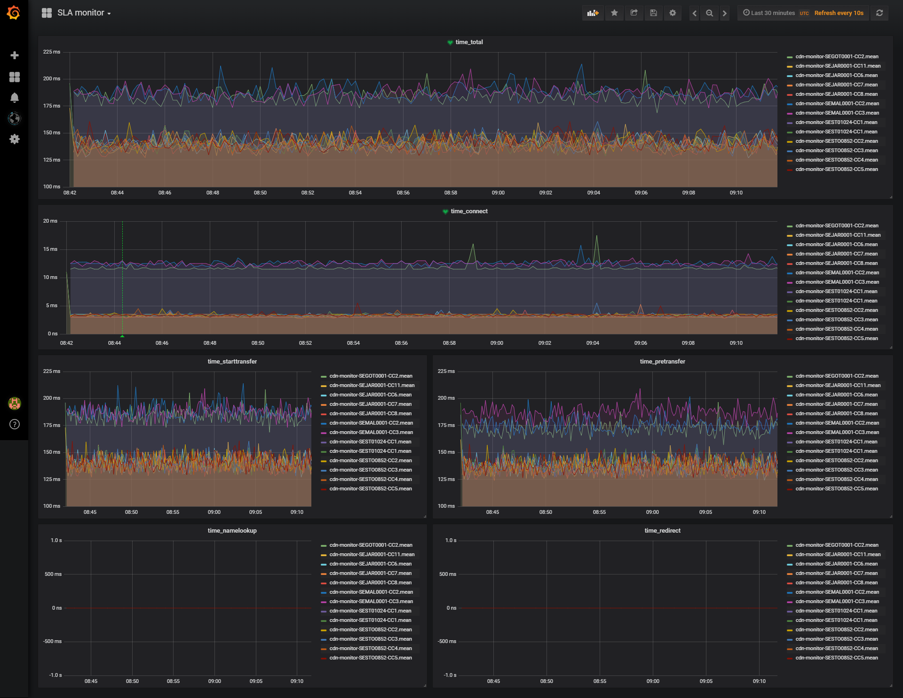
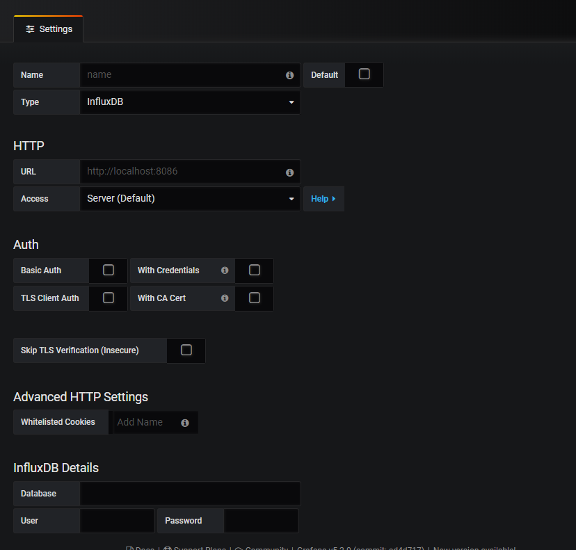

# Server Monitor 2.0

**Modern, open-source server and network monitoring with plug-and-play agents, InfluxDB, and Grafana dashboards. Crowdsourcing and alerting ready.**

---

> ⚡️ **Version 2.0 in progress!**  
> See [ROADMAP.md](./ROADMAP.md) for all planned updates and features.  
> This project is being fully modernized for 2024+ – Docker-first, Python and Bash agents, YAML/JSON config, and open community support.

---

## What’s new (work in progress):

- Docker Compose for one-line startup
- InfluxDB 2.x and Grafana 10+ support
- Plug-and-play agent (Bash/Python) – monitor HTTP, DNS, API endpoints
- Crowdsourcing: Contribute data from anywhere, see public dashboards!
- Smart alerts (Slack, Discord, Email)
- Modern onboarding and docs

---

# server-monitor

Simple server monitor with agents that reports to influxdb and grafana




## Setup

This setup is for Ubuntu server 18.04


1. Install git

```
sudo apt-get -y install git

```

Make tmp directory and clone

```
cd /
sudo mkdir /tmp
cd /tmp
git clone https://github.com/Caripson/server-monitor.git
```

Setup influxdb

```
curl -sL https://repos.influxdata.com/influxdb.key | sudo apt-key add -
source /etc/lsb-release
echo "deb https://repos.influxdata.com/${DISTRIB_ID,,} ${DISTRIB_CODENAME} stable" | sudo tee /etc/apt/sources.list.d/influxdb.list

```

Then, install and start the InfluxDB service:

```
sudo apt-get update && sudo apt-get install influxdb
sudo systemctl unmask influxdb.service
sudo systemctl start influxdb
```

Config InfluxDB

```
https://docs.influxdata.com/influxdb/v1.6/administration/config/
```

Setup grafana

```
wget https://s3-us-west-2.amazonaws.com/grafana-releases/release/grafana_5.3.0_amd64.deb
sudo dpkg -i grafana_5.3.0_amd64.deb
```

## Create Data source for InfluxDb in Grafana



## Setup script

Update script with server settings

```
vi /tmp/server-monitor/runme.sh

#update array with server ip and name of the server
declare -a arr=("8.8.8.8@SESTO0852-CC1" "99.99.99.99@SESTO0852-CC2")

#update dns record we should check
dnsname="my-server.com"

#Update server adress for InfluxDB
influddb="127.0.0.1:8086"

#Update the file url to the file you want to curl
sURL=https://${NAMES[0]}/img/36090/r20-100KB.png
```

chmod the runme.sh

```
chmod u+x vi /tmp/server-monitor/runme.sh

```

Add the script to crontab

```
crontab -e

# run evey min
* * * * * /tmp/server-monitor/runme.sh
# every 30 select
* * * * * /tmp/server-monitor/runme.sh
* * * * * ( sleep 30 ; /tmp/server-monitor/runme.sh )
```
Setup the scrip on multiple agents for better monitoring.

## Import dashboard in grafana

Create new, import dashboard

```
Uploda the jsoson file from
/tmp/server-monitor/dashboard.json
```

## Support on Beerpay
Hey dude! Help me out for a couple of :beers:!

[](https://beerpay.io/Caripson/server-monitor)  [](https://beerpay.io/Caripson/server-monitor?focus=wish)
